# Animation Video Maker

**20 visual styles. 20 original T2S Tech service examples. One reusable production workflow.**

An English-language skill package for agents that can read files, write JavaScript and run local tools. Create editable Canvas animations and export checked MP4s without a video-generation API, a framework or a required model provider.

**Start here:** [Agent skill](SKILL.md) · [Local interactive gallery](gallery.html) · [Runtime/setup](references/runtime.md) · [Style selection and optional Jev](references/style-selection.md) · [Validation](references/validation.md)

The HTML gallery runs after downloading/cloning the package. GitHub's source viewer does not execute HTML. Each row in the gallery below links to the video file, editable player and style instructions.

## What is included

- One operational root skill and 20 style-specific `SKILL.md` guides.
- 20 original examples featuring five verified [T2S Tech services](https://t2stech.com/#services), four treatments per service.
- MP4s at 1920×1080, 30 fps, 20 seconds; intentionally no audio.
- Editable scenes, official example brand assets, embedded fonts, local playback controls and accessible transcripts.
- Shared native Canvas runtime, Python/Playwright/FFmpeg renderer and regression checks.
- Optional Jev-assisted style retrieval, with an ordinary manual-selection fallback.

The examples demonstrate the library and introduce T2S. The skills themselves are reusable for other organizations. **Replace T2S brand and content when creating your own examples.**

## Use with an agent

Copy this whole `animation-video-maker` directory into the agent's documented skill location, or point the agent at `SKILL.md` in your checkout. Do not assume all agents discover nested skills: the root explicitly loads the chosen style guide by relative path. Keep the shared `assets`, `scripts`, `references` and `examples` alongside `styles`.

Example request:

> Create a 20-second animation explaining our migration approach to nontechnical managers. Use the Animation Video Maker workflow. Suggest a style if none is explicit, verify the claims against the supplied source, then deliver the editable scene and a validated MP4.

No Jev setup is required. A configured Jev installation may shortlist descriptions for an ambiguous request, but an explicit user choice takes precedence. See the selection guide for privacy, setup and fallback rules.

Some agents recursively discover the nested guides as separate skills. If you already installed earlier standalone `animation-*` skills, check for duplicate names before installing this bundle. Migrating or removing those older installations is an explicit local decision; cloning this repository does not modify them.

## Preview and export

Open `gallery.html` locally, or serve this directory on localhost with `python -m http.server 8000 --bind 127.0.0.1`. The preview itself needs no API credentials or external requests.

To export, install/reuse Python, Playwright/Chromium and FFmpeg as described in [runtime.md](references/runtime.md), then run from this directory through the agent's terminal tool:

```sh
python scripts/render.py examples/blueprint/index.html my-animation.mp4 --duration 20 --fps 30
```

Use `--samples-only` for still-frame QA first. Existing outputs are protected unless `--overwrite` is explicitly supplied. Only render reviewed local HTML; browser request blocking is not an OS-level sandbox.

## Gallery

| Preview | Style and service | Open |
|---|---|---|
| 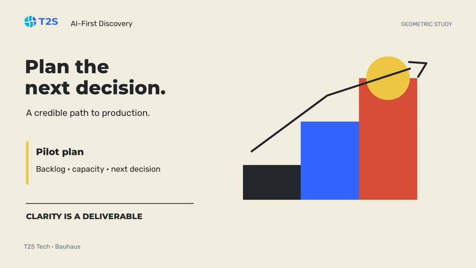 | **Bauhaus**<br>AI-First Discovery | [Video](examples/bauhaus/video.mp4) · [Edit](examples/bauhaus/index.html) · [Skill](styles/bauhaus/SKILL.md) |
| 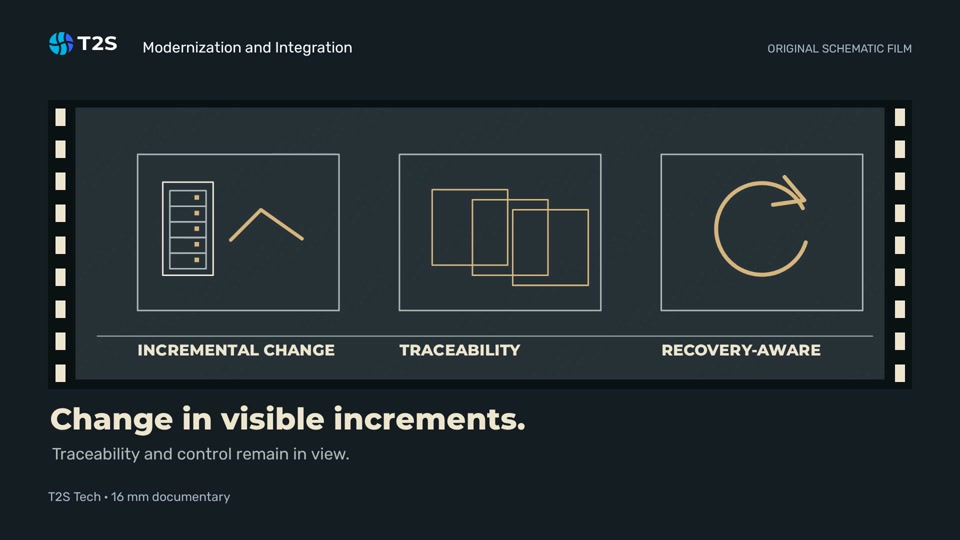 | **16 mm documentary**<br>Modernization and Integration | [Video](examples/film-documentary/video.mp4) · [Edit](examples/film-documentary/index.html) · [Skill](styles/film-documentary/SKILL.md) |
| 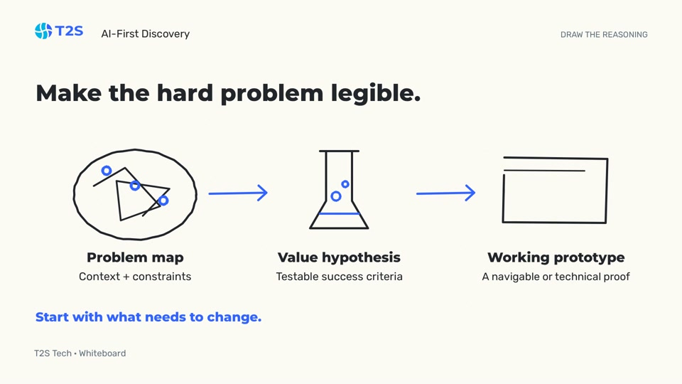 | **Whiteboard**<br>AI-First Discovery | [Video](examples/whiteboard/video.mp4) · [Edit](examples/whiteboard/index.html) · [Skill](styles/whiteboard/SKILL.md) |
| 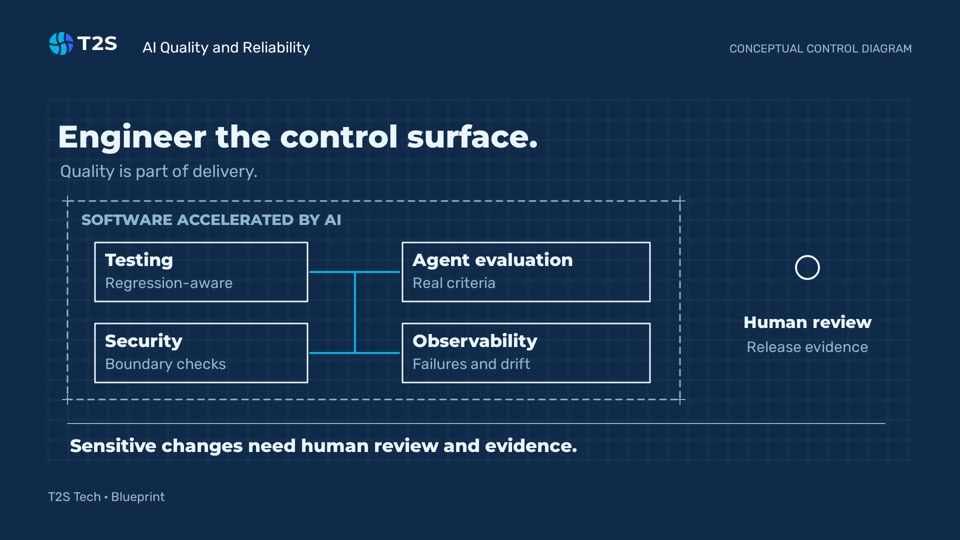 | **Blueprint**<br>AI Quality and Reliability | [Video](examples/blueprint/video.mp4) · [Edit](examples/blueprint/index.html) · [Skill](styles/blueprint/SKILL.md) |
| 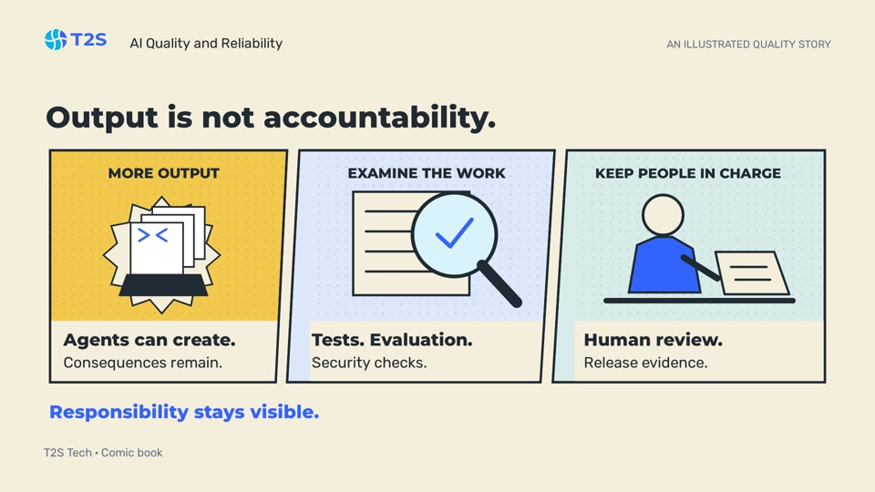 | **Comic book**<br>AI Quality and Reliability | [Video](examples/comic-book/video.mp4) · [Edit](examples/comic-book/index.html) · [Skill](styles/comic-book/SKILL.md) |
| 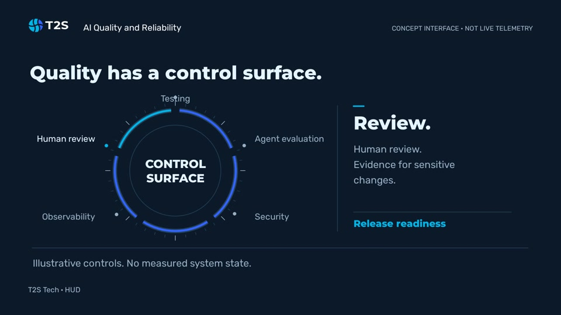 | **HUD**<br>AI Quality and Reliability | [Video](examples/hud/video.mp4) · [Edit](examples/hud/index.html) · [Skill](styles/hud/SKILL.md) |
| 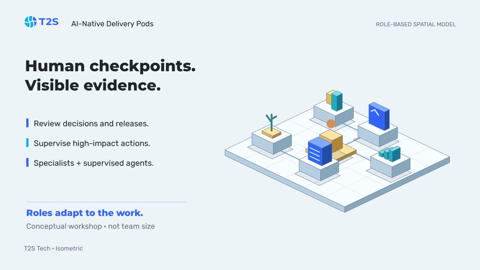 | **Isometric**<br>AI-Native Delivery Pods | [Video](examples/isometric/video.mp4) · [Edit](examples/isometric/index.html) · [Skill](styles/isometric/SKILL.md) |
| 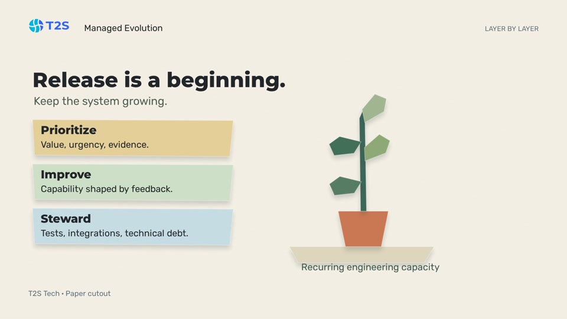 | **Paper cutout**<br>Managed Evolution | [Video](examples/paper-cutout/video.mp4) · [Edit](examples/paper-cutout/index.html) · [Skill](styles/paper-cutout/SKILL.md) |
| 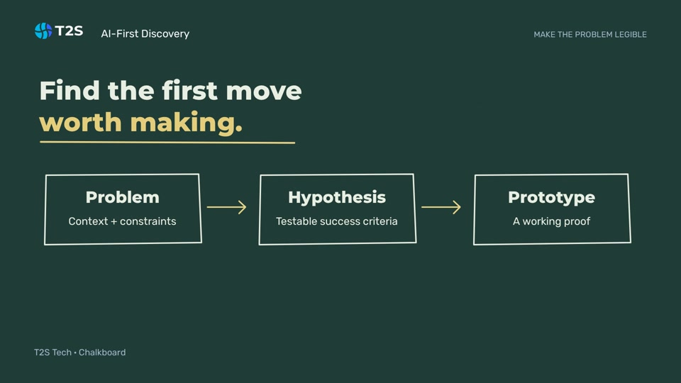 | **Chalkboard**<br>AI-First Discovery | [Video](examples/chalkboard/video.mp4) · [Edit](examples/chalkboard/index.html) · [Skill](styles/chalkboard/SKILL.md) |
| 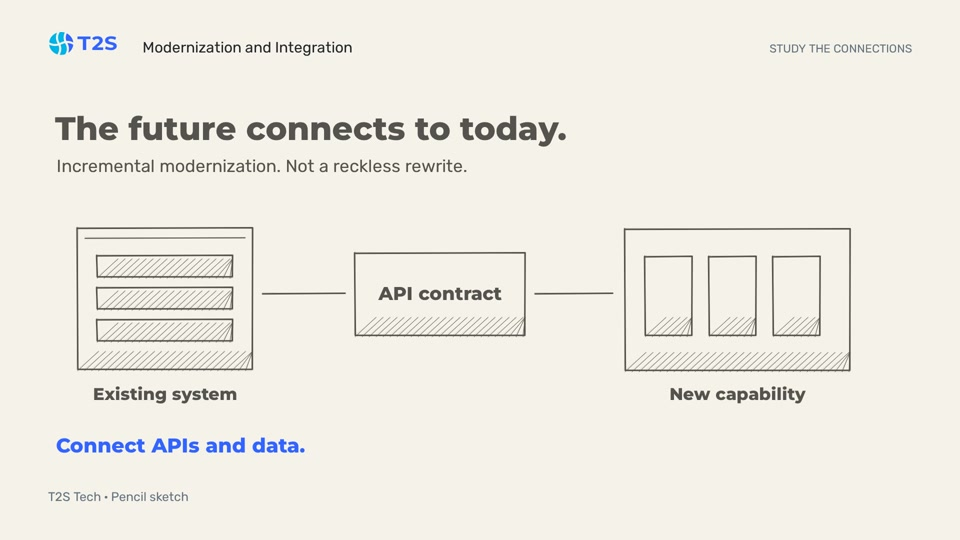 | **Pencil sketch**<br>Modernization and Integration | [Video](examples/pencil-sketch/video.mp4) · [Edit](examples/pencil-sketch/index.html) · [Skill](styles/pencil-sketch/SKILL.md) |
| 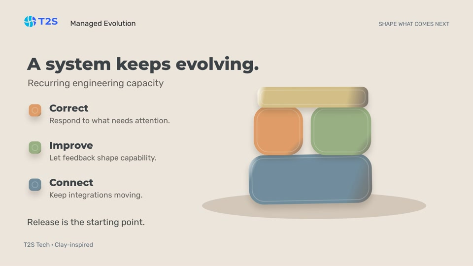 | **Clay-inspired**<br>Managed Evolution | [Video](examples/clay/video.mp4) · [Edit](examples/clay/index.html) · [Skill](styles/clay/SKILL.md) |
| 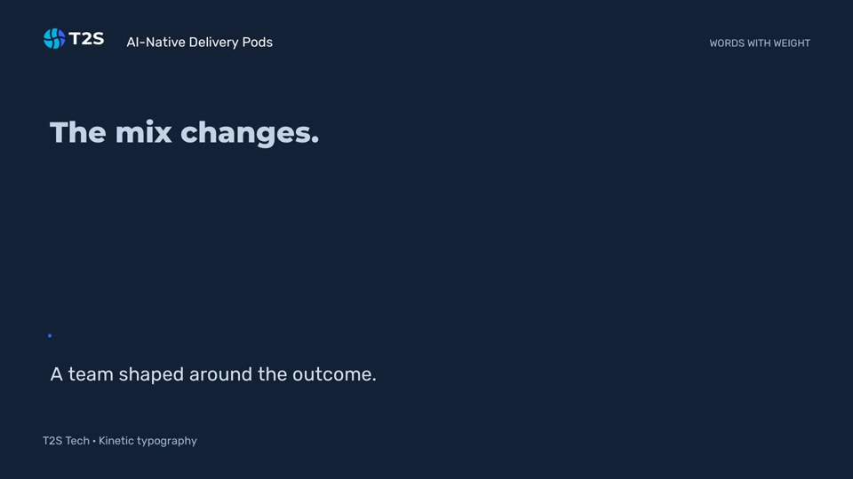 | **Kinetic typography**<br>AI-Native Delivery Pods | [Video](examples/kinetic-typography/video.mp4) · [Edit](examples/kinetic-typography/index.html) · [Skill](styles/kinetic-typography/SKILL.md) |
| 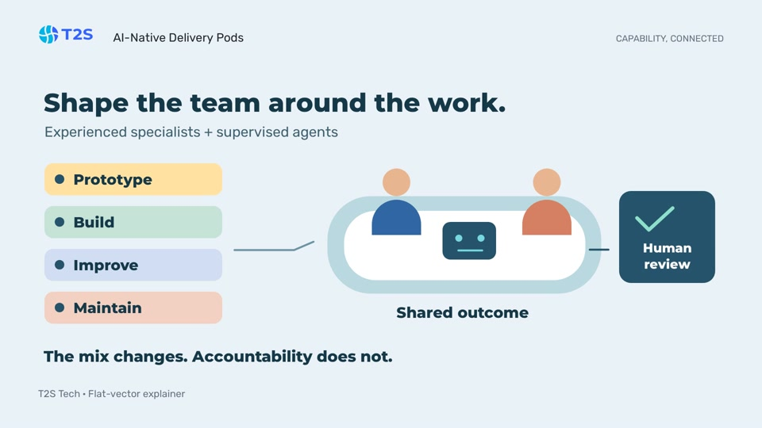 | **Flat-vector explainer**<br>AI-Native Delivery Pods | [Video](examples/flat-vector-explainer/video.mp4) · [Edit](examples/flat-vector-explainer/index.html) · [Skill](styles/flat-vector-explainer/SKILL.md) |
| 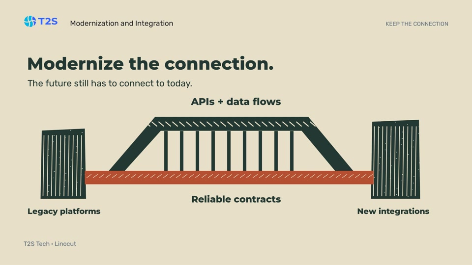 | **Linocut**<br>Modernization and Integration | [Video](examples/linocut/video.mp4) · [Edit](examples/linocut/index.html) · [Skill](styles/linocut/SKILL.md) |
| 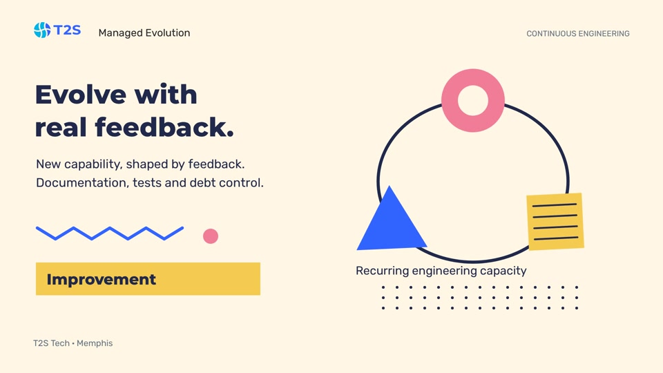 | **Memphis**<br>Managed Evolution | [Video](examples/memphis/video.mp4) · [Edit](examples/memphis/index.html) · [Skill](styles/memphis/SKILL.md) |
| 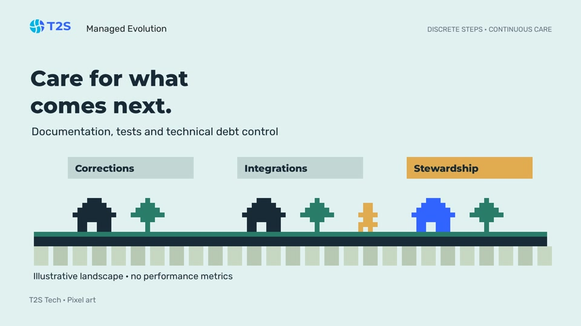 | **Pixel art**<br>Managed Evolution | [Video](examples/pixel-art/video.mp4) · [Edit](examples/pixel-art/index.html) · [Skill](styles/pixel-art/SKILL.md) |
| 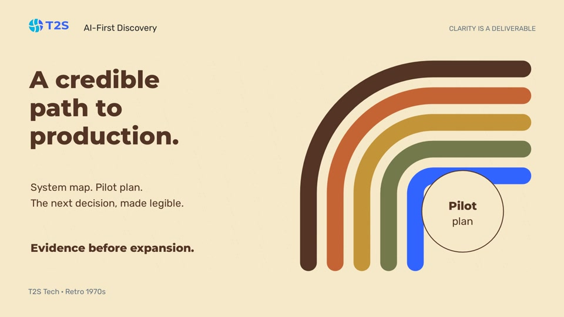 | **Retro 1970s**<br>AI-First Discovery | [Video](examples/retro-70s/video.mp4) · [Edit](examples/retro-70s/index.html) · [Skill](styles/retro-70s/SKILL.md) |
| 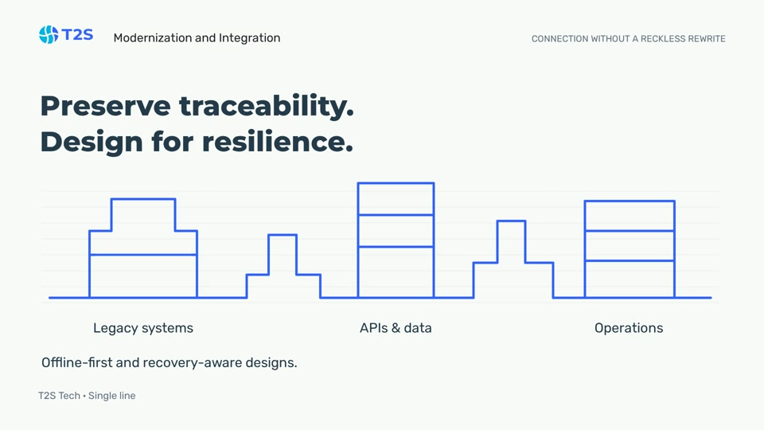 | **Single line**<br>Modernization and Integration | [Video](examples/single-line/video.mp4) · [Edit](examples/single-line/index.html) · [Skill](styles/single-line/SKILL.md) |
| 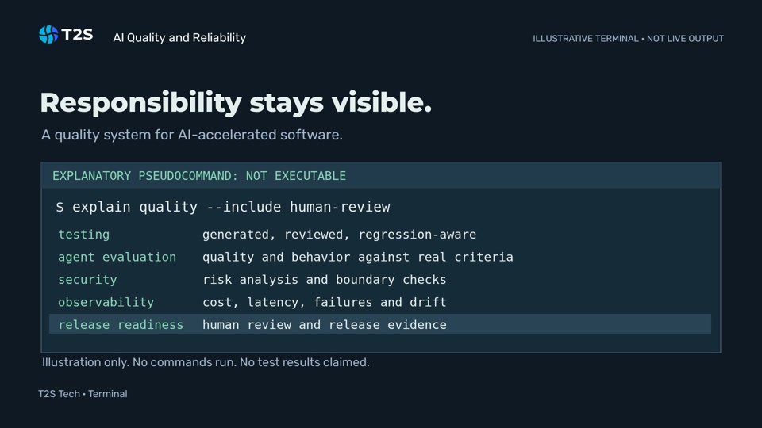 | **Terminal**<br>AI Quality and Reliability | [Video](examples/terminal/video.mp4) · [Edit](examples/terminal/index.html) · [Skill](styles/terminal/SKILL.md) |
| 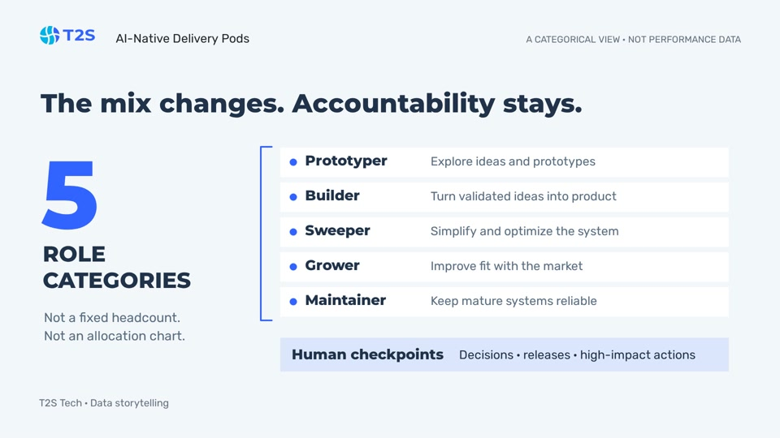 | **Data storytelling**<br>AI-Native Delivery Pods | [Video](examples/data-storytelling/video.mp4) · [Edit](examples/data-storytelling/index.html) · [Skill](styles/data-storytelling/SKILL.md) |

## Design principles

- A different style changes drawing, composition and movement, not just color.
- Real evidence beats plausible metrics. Illustrated diagrams, simulated terminals and HUDs are labeled as such.
- Words and logos stay exact. Body text remains readable; the final CTA is stable.
- A single shared runtime/renderer avoids 20 duplicate dependencies.
- A reliable result includes real export, visual inspection, metadata checks and editable files.

`ponytail:` release 0.1.0 deliberately targets silent, horizontal Full HD. Clay/film/pencil/print appearances are procedural Canvas interpretations, not physical media or photorealistic footage. Vertical output, sound and true 3D require a new brief and corresponding validation, rather than stretching the existing assets.

## Rights and attribution

Original code and documentation in this directory are MIT licensed. T2S trademarks/logo assets are excluded from that grant; Montserrat and Rubik retain their OFL notices. See [LICENSE](LICENSE), [NOTICE](NOTICE.md) and [sources](references/sources.md).

The visual taxonomy was inspired by [yasinozmeen/animasyon-stil-katalogu](https://github.com/yasinozmeen/animasyon-stil-katalogu). This is a new implementation, not a redistribution of that repository's source or its author's private skill. No endorsement or affiliation is implied.
